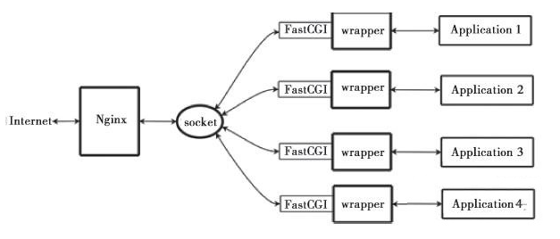

## Nginx配置

### Apache的优缺点

优点：

- Apache的rewrite功能比nginx的要强大
- 模块非常多，基本想要的功能都能找到模块
- 存在时间较长，文献较全，bug也相对较少
- apache 超稳定
- apache 在处理动态请求有优势，nginx 在这方面是鸡肋，一般动态请求要 apache 去做，nginx 适合静态和反向。
- 动静态解析都超稳定

缺点：

- 由于工作模式是同步阻塞型，导致资源消耗较高，并发能力较差

### Nginx的优缺点 

优点：

- 轻量级服务，采用 C 进行编写，同样的 web 服务比Apache占用更少的内存及资源

- nginx 处理静态文件好，静态处理性能比 apache 高三倍以上

- 并发能力强，nginx 处理请求是异步非阻塞的，而apache 则是阻塞型的，在高并发下nginx 能保持低资源低消耗高性能

- nginx 配置简洁，正则配置让很多事情变得简单，而且改完配置能使用 -t 测试配置有没有问题，apache 配置复杂 ，重启的时候发现配置出错了，会很崩溃

- nginx 作为负载均衡服务器，支持 7 层负载均衡

- 启动特别容易, 并且几乎可以做到 7*24 不间断运行，即使运行数个月也不需要重新启动，还能够不间断服务的情况下进行软件版本的升级

- 高度模块化的设计，编写模块相对简单

- 社区活跃，各种高性能模块产出迅速

  

缺点：

- 动态处理上需要使用fastcgi连接PHP的FPM服务，相比Apache不占优势

### Nginx+FastCGI运行原理

Nginx不支持对外部程序的直接调用或者解析，所有的外部程序（包括PHP）必须通过FastCGI接口来调用。FastCGI接口在Linux下是socket（这个socket可以是文件socket，也可以是ip socket）。为了调用CGI程序，还需要一个FastCGI的wrapper（wrapper可以理解为用于启动另一个程序的程序），这个wrapper绑定在某个固定socket上，如端口或者文件socket。当Nginx将CGI请求发送给这个socket的时候，通过FastCGI接口，wrapper接收到请求，然后派生出一个新的线程，这个线程调用解释器或者外部程序处理脚本并读取返回数据；接着，wrapper再将返回的数据通过FastCGI接口，沿着固定的socket传递给Nginx；最后，Nginx将返回的数据发送给客户端。这就是Nginx+FastCGI的整个运作过程，如图所示。

### Apache和Nginx的选择

Nginx 适合做静态处理，简单，效率高

Apache 适合做动态处理，稳定，功能强

并发较高的情况下优先选择Nginx，并发要求不高的情况下两者都可以

规模稍大的可以使用Nginx作为反向代理，然后将动态请求负载均衡到后端Apache上

### 为什么Nginx的并发能力强，资源消耗低？

#### 同步和异步：

同步：小明收到快递将送达的短信，在楼下一直等到快递送达。

异步：小明收到快递将送达的短信，小明不会下楼去取，而是快递小哥到楼下后，打电话通知小明，然后小明下楼取快递。

### 阻塞和非阻塞：

阻塞：小明收到快递即将送达的信息后，什么事都不做，一直专门等快递。

非阻塞：小明收到快递即将送达的信息后，等快递的时候，还一边敲代码，一边听歌，等着快递送达的消息。

Nginx以异步非阻塞方式工作

- 客户端发送request，服务器分配work进程来处理
- 能立即处理完的，处理后work进程释放资源，进行下一个request的处理
- 不能立即处理完的work进程注册返回事件，然后接着去处理其他request
- 当之前的request结果返回后，触发返回事件，由空闲work进程接着处理通过这种快速处理，快速释放请求的方式，达到同样的配置可以处理更大并发量的目的

## Nginx进阶

### Nginx的常用模块，并描述其功能

#### http_ssl_module

实现服务器加密传输的模块，部署完成后可使用https://协议进行数据传输，保证数据传输过程的安全

#### http_image_filter_module

通过该模块可以实现图片裁剪，将过大的图片裁剪为指定大小的图片，生成缩略图，保证传输速率，该选项默认不开启，需要人为指定

`image_filter resize $h $w`

#### http_rewrite_moduleNginx

的地址重写模块，功能同Apache的一样，可以实现通过正则匹配来完成条件判断，然后进行域名或url的重写。例如：多域名、http -> https

#### http_proxy_module

Nginx 的反向代理功能，由于Nginx的高并发特性，很多时候我们都选择使用Nginx作为网站的前置服务器，一般会和upstream模块一起使用，完成压力分摊工作。

#### http_upstream_module

Nginx的负载均衡模块，一般和http_proxy模块一起使用，用来对后台服务器的任务调度及分配，分配原则可以通过算法进行控制。常见模式：Nginx+Apache、Nginx+Tomcat

### Nginx是如何连接PHP进行页面解析的

Nginx支持PHP

1. Nginx支持fastCGI功能（默认支持）
2. PHP编译时开启FPM服务（编译时指定）
3. 在Nginx配置文件中添加匹配规则（匹配后缀是.php）

### 描述Nginx和Tomcat之间的数据传输过程

## Nginx 添加新模块（SSL、fastdfs-nginx-module 等）

Nginx 添加新模块（SSL、fastdfs-nginx-module 等）：[https://zhuanlan.zhihu.com/p/47928700](https://zhuanlan.zhihu.com/p/47928700)

## Nginx图解

